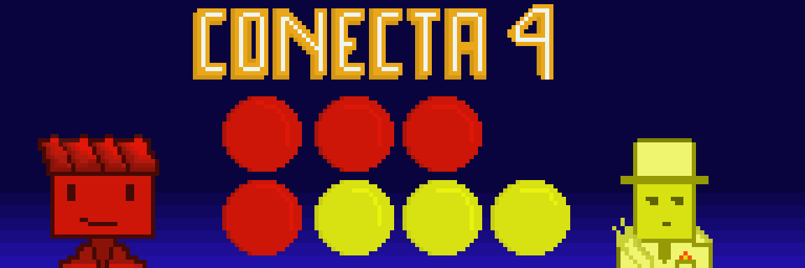
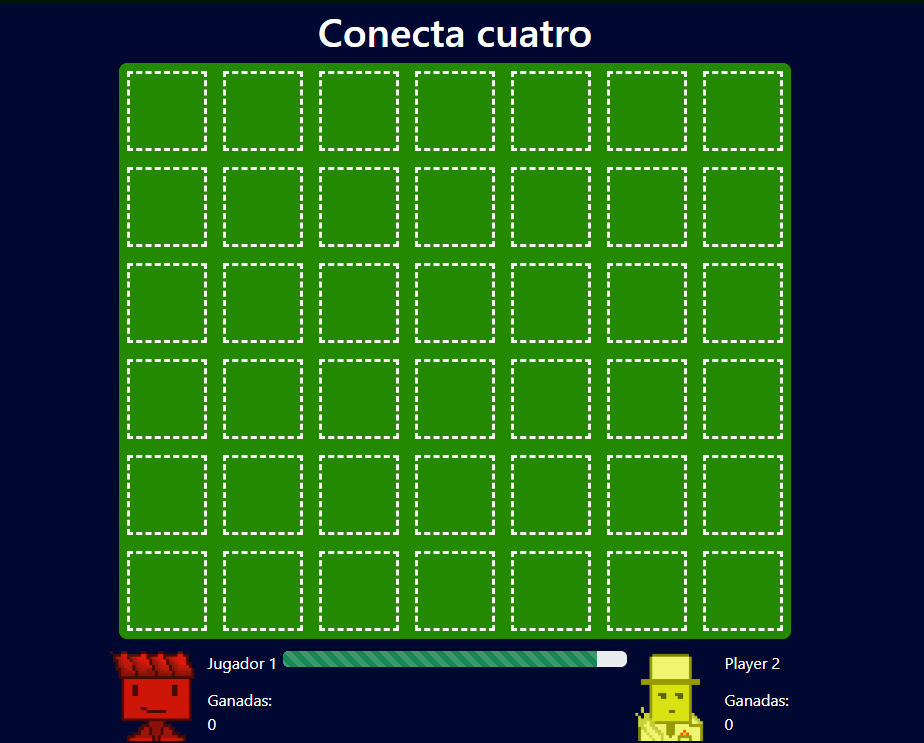

# 🎯 Conecta 4 – ¡Desafía a tu rival!


> El clásico juego de estrategia ahora en versión web, desarrollado con **Angular** ⚡  
> Reta a tus amigos, conecta tus fichas y conviértete en el maestro del tablero 🧠🔥

---

## 🕹️ ¿De qué trata?

**Conecta 4** es un juego para **dos jugadores** donde el objetivo es conectar **cuatro fichas del mismo color** de forma horizontal, vertical o diagonal antes que tu oponente.  
Esta versión está creada completamente con **Angular**, ofreciendo una experiencia fluida, interactiva y moderna.

---

## ✨ Características principales

- 🎮 Modo **jugador vs jugador**  
- 🔁 Boton de **reinicio** 
- ⏱️ Contador de tiempo por turno  
- 🎯 Detección automática de ganador  
- 📱 Diseño **responsive** para distintos dispositivos  

---

## 🧩 Capturas de pantalla

> 📸 Agrega aquí tus imágenes o GIFs del juego  
Ejemplo:

```md


